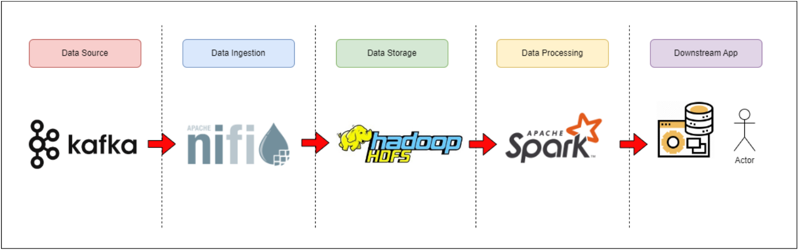
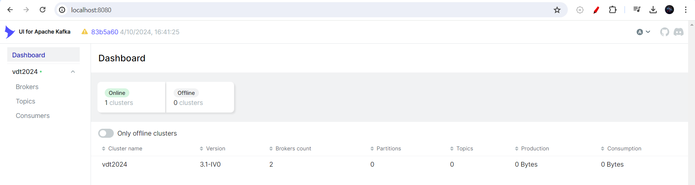
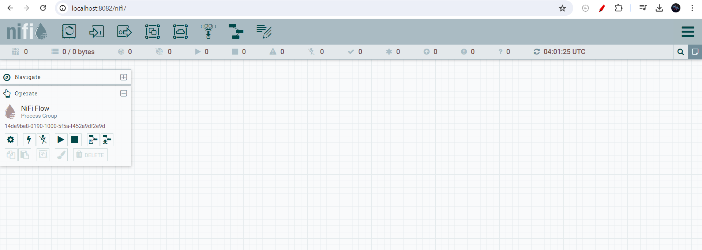

# [Assignment] BUILDING DATA PIPELINE
<div style="margin-left: 170px;">Viettel Digital Talent 2024</div>


  
**Author**: Thanh Dinh  
**Start date**: 29/05/2024  
**Description**: For this assignment, the task is to construct a basic data platform utilizing the following technologies: Apache Kafka, Apache NiFi, Hadoop HDFS, and Apache Spark.


## Architecture


## Requirments
- Apache Kafka
    - Task: Develop a program to read from log_action.csv and push data to a Kafka Topic
vdt2024 , including the following field: student_code (*number*), activity (*string*), numberOfFile (*number*), timestamp (*string*).
- Apache NiFi
    - Task: Deploy Apache NiFi to pull data from the Kafka Topic **vdt2024** , process it, and
store it in HDFS at the path */raw_zone/fact/activity*
    - Data Format: Store the data in *parquet* format.
- Hadoop HDFS
    - Task: Store the file danh_sach_sv_de.csv into HDFS.
- Apache Spark
    - Task: Write a program to process data stored in HDFS using Apache Spark.
    - Data Processing Requirement: Calculate the total number of files interacted with daily for each type of activity performed by each student. Save the result to an output file.
    - Output File Details:
        - File Name: student_name.csv
        - Format: CSV
        - Schema: date, student_code, student_name, activity, totalFile

## Preparation:
- Docker
- Docker compose
- Python
- Docker images
- Library: kafka-python, pyspark


## Getting Started

To deploy the system, ensure that you are in */src*, run:
```bash
docker-compose -f docker-compose.yml -p demo-pipeline up -d
```

Go to *localhost:8080* to check Kafka UI and *localhost:8082/nifi* to check NiFi UI.




Config NiFi with 2 processors: *ConsumeKafkaRecord_2.0* and *PutHDFS*:
- ConsumeKafkaRecord_2.0
    - Kafka Brokers: broker01:9093,broker02:9095
        - NiFi and Kafka use the common network inside Docker, so use broker01:9093,...
    - Topic Name(s): vdt2024
    - Topic Name Format: names
    - Record Reader: JsonTreeReader
    - Record Writer: ParquetRecordSetWriter
    - Group ID: nifi-consumer

- PutHDFS:
    - Hadoop Configuration Resources: */opt/nifi/nifi-current/hdfs_config/core-site.xml,/opt/nifi/nifi-current/hdfs_config/hdfs-site.xml*
        - Find the files in *./src/nifi/nifi_config* of the repository (you can see the template from internet)
    - Directory: /raw_zone/fact/activity
        - The path that we will store files in HDFS


Go into container of namenode check for the written file from NiFi and put files *danh_sach_sv_de.csv* into HDFS
```bash
hdfs dfs -put /hadoop_data/data/danh_sach_sv_de.csv /raw_zone/fact
```

Go into container of sparkworker to process data strored in HDFS.
```bash
pip install pyspark
python /spark/spark_data/spark_processing.py
```


*For more detail, read the report please*
